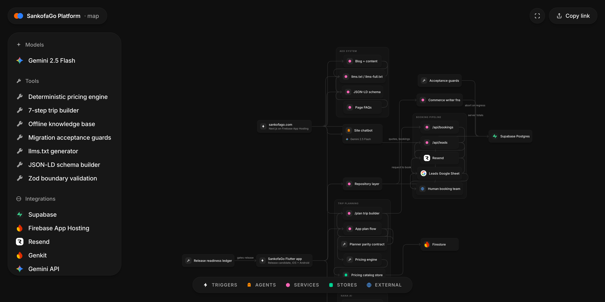

# SankofaGo Platform

Ghana heritage travel for the diaspora. An AI plans it. A real person books it.

*Interactive, pannable version: [open the architecture map](https://fred-in-tech.github.io/sankofago-platform/map/)*

## What it is

SankofaGo is a two-surface travel platform: a Flutter app (release candidate — 454+ passing tests, 27 Supabase migrations with live RLS proofs) and a live Next.js website with a working trip builder, booking pipeline, and lead capture. Travelers describe the trip they want, the system drafts an itinerary with an honest estimate range, and a human on the SankofaGo team verifies suppliers, prices, and availability before anything is confirmed. Pre-launch: no user counts, ratings, or revenue claims — deliberately.

## Why I built it

Diaspora travelers planning a first trip to Ghana face a real trust gap: scattered suppliers, opaque pricing, and no one accountable if the plan falls apart on the ground. Pure-AI travel tools make that worse by confidently inventing availability. SankofaGo's answer is human-in-the-loop by design — the AI accelerates planning, but a real person owns every booking.

## Architecture

Entry points → planning → AI → commerce → stores:

| Layer | What happens |
|---|---|
| Entry | Next.js site (Firebase App Hosting) + Flutter app (feature-first: explore, plan, trips, checkout, supplier messaging) |
| Planning | 7-step trip builder on both surfaces, kept in lockstep by a written parity/estimate contract |
| Pricing | Deterministic engine (`src/lib/pricing.ts`): free-text intent parsing, versioned catalog, tier markups, ranges rounded outward — no LLM in the money path |
| AI | Nana, the travel companion, behind a swappable `NanaBrain` interface: offline `LocalNanaBrain` always present, feature-flagged `RemoteNanaBrain` → `nana-reply` Supabase Edge Function → Gemini 2.5 Flash. Site chat runs Genkit + the same model |
| Commerce | 27 Supabase migrations; SECURITY DEFINER writer functions compute totals server-side and ignore forged client prices; every migration ships inline acceptance guards |
| Pipelines | `/api/bookings` → Zod-validated, HTML-escaped email via Resend to the team; `/api/leads` → Google Sheet webhook with email fallback so a lead is never lost |
| AEO | Blog (16+ posts), `llms.txt` + `llms-full.txt` route handlers, per-page FAQs, and JSON-LD derived strictly from visible page text |

## Engineering highlights

- **Human-in-the-loop booking as architecture, not copy.** Nothing in the codebase can confirm a booking. The AI drafts, the pricing engine estimates a range, and the only "confirm" path is an email to a human who replies within 24–48 hours. The Nana system prompt hard-codes it: never claim a price, availability, or visa rule is confirmed.
- **Deterministic pricing engine.** Prices come from a versioned catalog with fixed tier markups and a 15% commission constant — testable, auditable, and immune to LLM hallucination. The estimate contract (range = 90–110% of midpoint, rounded outward to $100, 25% deposit preview) is a written interface both surfaces implement.
- **App↔site planner parity contract.** The web `/plan` builder and the Flutter plan flow follow the same documented step sequence and estimate rules (`Flutter/docs/pricing_interface_contract.md`), so a traveler moving between surfaces sees the same trip and the same numbers.
- **Graceful-degradation AI.** `NanaBrain` is an interface; `RemoteNanaBrain` is feature-flagged and falls back silently to the offline `LocalNanaBrain` on timeout, 503, malformed reply, or signed-out state. Nana always answers; she never surfaces a raw error. The provider key lives only in edge-function secrets — never in the app binary.
- **Database that defends itself.** Every migration carries inline SQL acceptance guards that abort deployment on grant/policy regressions. Live RLS proofs (saved under `supabase/tests/`) cover two-user plan-draft isolation, supplier-portal role isolation, illegal booking-lifecycle transitions, and a full commerce arc where a forged client price is ignored.
- **Honest-claims discipline as a release gate.** `docs/RELEASE_READINESS.md` classifies every claim as repository-complete, externally-blocked, or remaining work — with cited evidence. Invented testimonials were removed once and are structurally banned; JSON-LD is generated only from text a human can see on the page.
- **AEO before launch.** The site ships `llms.txt`/`llms-full.txt`, an RSS feed, sitemap, and FAQ schema built from one content module, so AI search engines index the honest version of the product from day one.

## Stack

| Layer | Tech |
|---|---|
| Mobile app | Flutter (feature-first), typed Supabase repository layer |
| Backend | Supabase (Postgres + RLS + Edge Functions), 27 migrations |
| Website | Next.js (App Router), Tailwind, Firebase App Hosting |
| AI | Genkit + Gemini 2.5 Flash; offline knowledge engine in-app |
| Email / leads | Resend; Google Sheets webhook with email fallback |
| Validation | Zod at every API boundary; honeypot anti-spam |

## Status & roadmap

- Website: live, with working booking and lead pipelines.
- Flutter app: release candidate — builds on iOS and Android, full test suite green, remaining items tracked honestly in the release-readiness ledger (store credentials, founder dashboard toggles).
- Next: launch the app, wire the remote Nana path on by default, and grow the supplier network behind the commerce schema.

## About this repo

This is a public architecture showcase of a private production codebase. The source stays private; this repo documents how it's built.

— Godfred Aidoo · [godfredaidoo.com](https://godfredaidoo.com) · [LinkedIn](https://www.linkedin.com/in/godfred-aidoo) · [more projects](https://github.com/Fred-In-tech)
